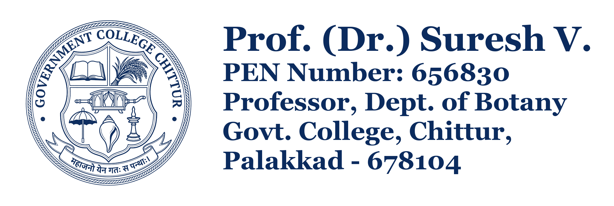

# Official Seal & Stamp Studio 🏛️✒️

A high-resolution, interactive digital and printable seal stamp generator built with modern web technologies, HTML5 Canvas, and vector styling.



## ✨ Features

- **High-Resolution Vector & Canvas Rendering**: Crisp rendering up to 600 / 1200 DPI Master Vector / 4K Ultra HD.
- **Native Vector SVG & High-Res Image Engine**:
  - **Direct Vector SVG Support**: Upload any `.svg` logo for 100% infinite clarity at any scale without raster downsampling.
  - **In-Browser Auto-Vectorize**: Convert raster PNG/JPG logos into clean vector SVG curves with one click.
  - **Smooth Anti-Aliased Thresholding**: Cubic Hermite smoothstep curve eliminates jagged/pixelated stair-step edges.
  - **Preserve Native Anti-Aliasing**: Retains original alpha transparency gradients for pre-cut PNG/WebP files.
  - **Customizable Edge Softening**: Adjustable smoothing slider (0 = Crisp Sharp, 5 = Smooth Vector-Like, 10 = Ultra Silky).
  - **Vector Logo & Vector Stamp Export**: Export independent SVG logos or complete scalable vector stamps (`.svg`).
  - Automatic tinting matching the chosen ink color or keep original multi-color emblem.
  - Shape masks: Circular seal, rounded rectangle, or uncropped natural ratio.
- **Customizable Stamp Details**:
  - Live editing of Name, Title, PEN / Employee ID, Designation, Institution, and Location.
- **Ink Color Engine**:
  - Official Stamp Navy (`#0b2b5e`)
  - Royal Blue (`#003399`)
  - Violet / Stamp Purple (`#4a148c`)
  - Official Red (`#b71c1c`)
  - Emerald Green (`#1b5e20`)
  - Document Black (`#111827`)
  - Deep Maroon (`#831843`)
  - Custom Color Picker (HEX/RGB)
- **Typography & Proportions**:
  - Classic academic and official serif fonts (*Merriweather*, *PT Serif*, *Libre Baskerville*, *Lora*, *EB Garamond*, *Cinzel*, *Times New Roman*).
  - Sliders for font sizes, logo dimensions, spacing, tilt rotation, opacity, and authentic rubber stamp ink bleed.
- **Border & Frame Options**:
  - Frameless (original scanned model format)
  - Clean Thin Box
  - Solid Official Box
  - Rounded Rectangle Frame
  - Double Line Legal Frame
  - Classic Dashed Box
- **Export & Integration Suite**:
  - 📥 **Download Transparent PNG** (1x Web, 2x Retina, 4x 300 DPI Print-ready, 8x 600 DPI Master)
  - 📥 **Download Vector SVG**
  - 📋 **Copy Stamp Image to Clipboard** (one-click copy to paste directly in MS Word, Google Docs, Email)
  - 🖨️ **Print Stamp at 1:1 Scale** (`@media print` optimized)
  - 💻 **Embeddable HTML/CSS snippet generator**
  - 📜 **Interactive Document Signing Simulator**

## 🚀 Getting Started

Simply open `index.html` in any modern web browser. No external build tools, servers, or dependencies required!

```bash
# Clone the repository
git clone https://github.com/sureshmagnolia/sealstamp.git

# Open the studio in your browser
cd sealstamp
start index.html
```

## 📄 Standalone Stamp Component

For a minimal, lightweight HTML/CSS stamp component without studio controls, open `stamp.html`.

## 🏛️ Default Institution
**Government College Chittur, Palakkad - 678104**  
*Department of Botany*
